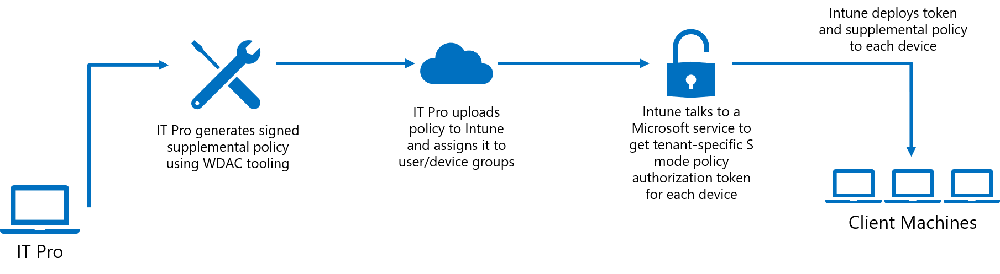

# Allow line-of-business Win32 apps on S mode devices with Intune

[Windows 10 in S mode](https://docs.microsoft.com/windows/deployment/s-mode) (S mode) is a locked-down operating system that is streamlined for security and runs Windows only components and Store apps. By default, S mode devices do not allow installation and execution of Win32 apps due to enforcement of an application control S mode base policy.

However, beginning with the Windows 10 November 2019 update (build 18363), Microsoft Intune enables customers to deploy and run business-critical Win32 applications, and Windows components that are normally blocked in S mode (for example, PowerShell.exe), on their Intune-managed Windows 10 in S mode devices.

With Intune, IT Pros can now configure their managed S mode devices by using a [**Windows Defender Application Control (WDAC) supplemental policy**](https://docs.microsoft.com/windows/security/threat-protection/windows-defender-application-control/lob-win32-apps-on-s) that expands the S mode base policy to authorize the apps their business uses. This feature changes the S mode security posture from “every app is Microsoft-verified" to “every app is verified by Microsoft or your organization”.

## Policy authorization overview

The general steps for expanding the S mode base policy on your Intune-managed devices are to generate a supplemental policy, sign that policy, and then upload the signed policy to Intune and assign it to user or device groups. Because you need access to WDAC PowerShell cmdlets to generate your supplemental policy, you should create and manage your policies on a non-S mode device. Once the policy has been uploaded to Intune, we recommend assigning it to a single test S-mode device to verify expected functioning before deploying the policy more broadly.

For detailed information on creating a supplemental policy with WDAC tooling and signing that policy, refer to [Allow Line-of-Business Win32 Apps on Intune-Managed S Mode Devices](https://docs.microsoft.com/windows/security/threat-protection/windows-defender-application-control/lob-win32-apps-on-s).

## Deploying an S mode supplemental policy through Intune

After creating and signing your WDAC supplemental policy, upload and deploy it through Intune using the following steps:

1. Sign in to the [Microsoft Endpoint Manager Admin Center](https://go.microsoft.com/fwlink/?linkid=2109431).
2. Select **Apps** > **S mode supplemental policies** > **Create policy**.
3. On the **Basics** page, add the following values:

    | Value | Description |
    |--------------|------------------------------------------------|
    | Policy file | The signed .p7b policy file |
    | Name | The name of this policy |
    | Description | [Optional] The description of this policy |

4. Click **Next: Scope tags**.

   On the **Scope tags** page you can optionally configure scope tags to determine who can see the app policy in Intune. For more information about scope tags, see [Use role-based access control and scope tags for distributed IT](~/fundamentals/scope-tags.md).
5. Click **Next: Assignments**.

   The **Assignments** page allows you to assign the policy to S mode device groups. It is important to note that you can assign a policy to a device whether or not the device is managed by Intune. At this time, there are no dynamically-generated S mode device groups.  
   > [!NOTE]
   > WDAC policies are enforced at the device level. A file which is allowed by any of the S mode supplemental policies on a device will be allowed to run for all users on that device.
6. Click **Next: Review + create** to review the values you entered for the profile.
7. When you are done, click **Create** to create the S mode supplemental policy in Intune. 

Once the policy is created, you will see it added to the list of S mode supplemental policies in Intune. Once the policy is assigned, the policy gets deployed to the devices.

## Optional: Process for deploying apps using catalogs through Intune

Your supplemental policy can be used to significantly relax the S mode base policy, but there are security trade-offs you must consider in doing so. For example, you can use a signer rule to trust an external signer, but that will authorize all apps signed by that certificate, which may include apps you don’t want to allow as well.

Instead of authorizing signers external to your organization, Intune has added new functionality to make it easier to authorize existing applications (without requiring repackaging or access to the source code) through the use of signed catalogs. This works for apps which may be unsigned or even signed apps when you don’t want to trust all apps that may share the same signing certificate.

Refer to [Optional: Process for Deploying Apps using Catalogs](https://docs.microsoft.com/windows/security/threat-protection/windows-defender-application-control/lob-win32-apps-on-s#optional-process-for-deploying-apps-using-catalogs) for more information on generating and signing app catalogs.

Once you have created and signed your app catalog, the steps to deploy it through Intune are:

1. Package the signed catalog into the *.intunewin* file using the [Microsoft Win32 Content Prep Tool](https://go.microsoft.com/fwlink/?linkid=2065730).

   There are no naming restrictions when creating a catalog file using the Content Prep Tool. When generating the *.intunewin* file from the specified source folder and setup file, you can provide a separate folder containing only catalog files by using the -a cmdline option.
2. Add the catalog to Intune and assign it to managed S mode devices.

   Note that you must deploy the catalog to the same security group as the supplemental policy so you can start targeting and assigning apps to those devices. This will allow your end users to install and execute the apps on the S mode devices.
3. Intune applies the signed app catalog to install the Win32 app on the S mode device using the [Intune Management Extension](intune-management-extension.md).

For more information on uploading, assigning, and monitoring your app catalogs through Intune, see [Win32 app management - Prepare the Win32 app content for upload](apps-win32-app-management.md#prepare-the-win32-app-content-for-upload).

## Policy reporting

The S mode supplemental policy, which is enforced at device level, only has device level reporting. Device level reporting is available for sucesss and error conditions.

Reporting values that are shown in the Intune console for S mode reporting polices:

- **Success**: The S mode supplemental policy is in effect.
- **Unknown**: The status of the S mode supplemental policy is not known.
- **TokenError**: The S mode supplemental policy is structurally okay but there is an error with authorizing the token.
- **NotAuthorizedByToken**: The token does not authorize this S mode supplemental policy.
- **PolicyNotFound**: The S mode supplemental policy is not found.

## Next steps

- For more information about adding apps to Intune, see [Add apps to Microsoft Intune](apps-add.md).
- For more information about Win32 apps, see [Intune Win32 app management](apps-win32-app-management.md).
