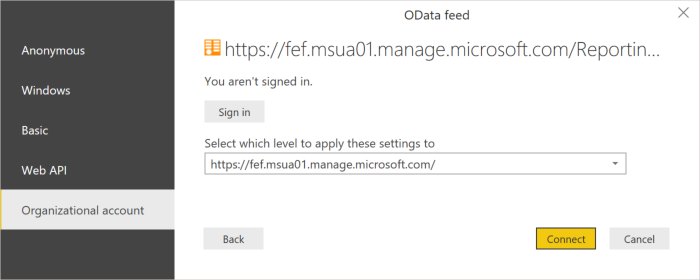
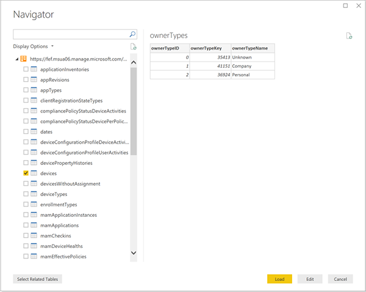
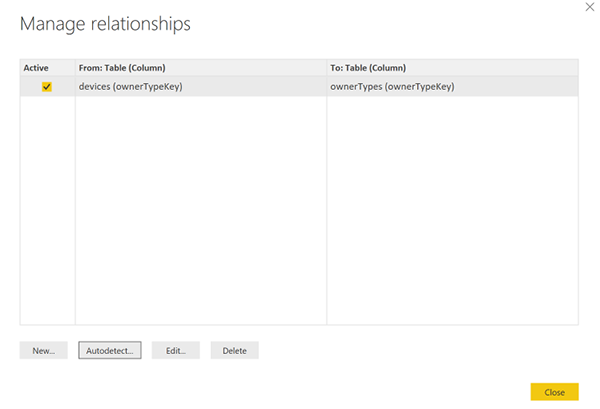
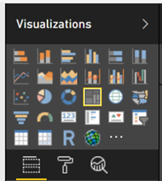
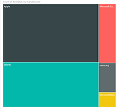
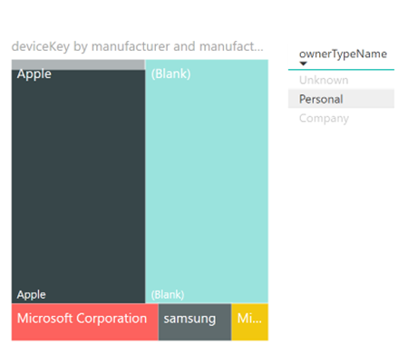

---
# required metadata
title: Create an Intune report from the OData feed with Power BI
titleSuffix: Microsoft Intune
description: Create a treemap visualization using Power BI Desktop with an interactive filter from the Intune Data Warehouse API.
keywords: Intune Data Warehouse
author: Erikre
ms.author: erikre
manager: dougeby
ms.date: 12/03/2019
ms.topic: reference
ms.service: microsoft-intune
ms.subservice: developer
ms.localizationpriority: medium
ms.technology:
ms.assetid: A2C8A336-29D3-47DF-BB4A-62748339391D

# optional metadata
#ROBOTS:
#audience:
#ms.devlang:
ms.reviewer: aanavath
ms.suite: ems
search.appverid: MET150
#ms.tgt_pltfrm:
ms.custom: intune-classic
ms.collection: M365-identity-device-management
---

# Create an Intune report from the OData feed with Power BI

This article explains how to create a treemap visualization of your Intune data using Power BI Desktop that users an interactive filter. For example, your CFO might like to know how the overall distribution of devices compares between company-owned devices and personal devices. The treemap provides insight into the total number of device types. You can review the number of iOS, Android, and Windows devices that are either company owned or personally owned.

## Overview of creating the chart

To create this chart, you will:
1. Install Power BI Desktop if you don't already have it.
2. Connect to the Intune Data Warehouse data model and retrieve current data for the model.
3. Create or manage the data model relationships.
4. Create the chart with data from the **devices** table.
5. Create an interactive filter.
6. View the finished chart.

### A note about tables and entities

You work with tables in Power BI. A table contains data fields. Each data field has a data type. The field can only contain data of the data type. Data types are numbers, text, dates, and so on. The tables in Power BI fill with recent historical data from your tenant when you load the model. Although the specific data changes with time, the table structure won't change unless the underlying data model is updated.

You may be confused by the use of the term *entity* and *table*. The data model is accessible through an OData (Open Data Protocol) feed. In the universe of the OData, the containers that are called tables in Power BI are called entities. These terms both refer to the same thing that holds your data. For more information about OData, see the [OData Overview](/odata/overview).

## Install Power BI Desktop

Install the latest version of Power BI Desktop. You can download Power BI Desktop from: [PowerBI.microsoft.com](https://powerbi.microsoft.com/desktop)

## Connect to the OData feed for the Intune Data Warehouse for your tenant

> [!Note]  
> You need permission to **Reports** in Intune. For more information, see [Authorization](../reports-api-url.md).

1. Sign in to [Intune](https://go.microsoft.com/fwlink/?linkid=2090973).
2. Open the **Intune Data Warehouse** pane by selecting the Data Warehouse link under **Other tasks** on the right side of the **Microsoft Intune - Overview** blade.
3. Copy the custom feed URL. For example:
`https://fef.tenant.manage.microsoft.com/ReportingService/DataWarehouseFEService?api-version=beta`
4. Open Power BI Desktop.
5. From the menubar, select **File** > **Get Data** > **Odata feed**.
6. Paste the custom feed URL, that you copied from the earlier step, into the URL box in the **OData feed** window.
7. Select **Basic**.

    

8. Select **OK**.
9. Select **Organization account**, and then sign in with your Intune credentials.

    

10. Select **Connect**. The Navigator will open and show you the list of tables in the Intune Data Warehouse.

    

11. Select the **devices** and the **ownerTypes** tables.  Select **Load**. Power BI loads data to the model.

## Create a relationship

You can import multiple tables to analyze not just the data in a single table but related data across tables. Power BI has a feature called **autodetect** that attempts to find and create relationships for you. The tables in the Data Warehouse have been built to work with the autodetect feature in Power BI. However, even if Power BI doesn't automatically find the relationships, you can still manage the relationships.

1. Select **Manage Relationships**.
2. Select **Autodetect...** if Power BI has not already detected the relationships.

The relationship is displayed in a From column to a To column. In this example, the data field **ownerTypeKey** in the **devices** table links to the data field **ownerTypeKey** in the **ownerTypes** table. You use the relationship to look up the plain name of the device type code in the **devices** table.

## Create a treemap visualization

A treemap chart shows hierarchical data as boxes within boxes. Each branch of the hierarchy is a box contains smaller boxes showing subbranches. You can use Power BI desktop to create a treemap of your Intune tenant data that shows relative amounts of device manufacturer types.

1. In the **Visualizations** pane, find and select **Treemap**. The **Treemap** chart will be added to the report canvas.
2. In the **Fields** pane, find the `devices` table.
3. Expand the `devices` table and select the `manufacturer` data field.
4. Drag the `manufacturer` data field to the report canvas and drop it on the **Treemap** chart.
5. Drag the `deviceKey` data field from the `devices` table to the **Visualizations** pane and drop it on under the **Values** section in the box labeled **Add data fields here**.  

You now have a visual that shows the distribution of manufacturers of devices within your organization.

## Add a filter

You can add a filter to your treemap so that you can answer additional questions using your app.

1. To add a filter, select the report canvas, and then select the **Slicer icon** () under **Visualizations**. The empty **Slicer** visualization will appear on the canvas.
2. In the **Fields** pane, find the `ownerTypes` table.
3. Expand the `ownerTypes` table and select the `ownerTypeName` data field.
4. Drag the `onwerTypeName` data field from the `ownerTypes` table to the **Filters** pane and drop it on under the **Filters on this page** section in the box labeled **Add data fields here**.  

   Under the `OwnerTypes` table, there's a data field called `OwnerTypeKey`that contains a data as to whether a device is company-owned or personal. Since you would like to show friendly names in this filter, look for the `ownerTypes` table and drag the **ownerTypeName** to the Slicer. This example shows how the data model supports relationships between tables.

You now have an interactive filter that can be used to toggle between company owned and personally owned devices. Use this filter to see how the distribution changes.

1. Select **Company** within the Slicer to see that the company owned device distribution.
2. Select **Personal** within the Slicer to see the personally owned devices.

## Next steps

- Learn more about [creating and managing relationships](https://powerbi.microsoft.com/documentation/powerbi-desktop-create-and-manage-relationships/) in the Power BI Desktop in the Power BI documentation.
- Consult the [Intune Data Warehouse Model](reports-ref-data-model.md).
